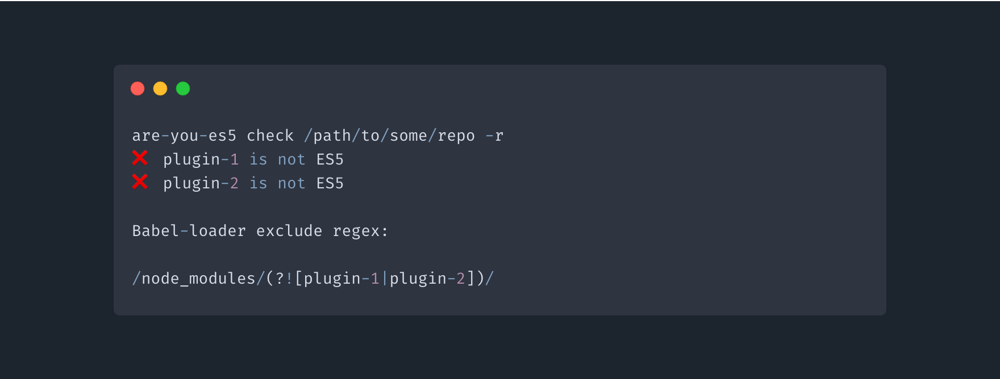

# are-you-es5
[](https://circleci.com/gh/obahareth/are-you-es5)
[](https://www.npmjs.com/package/are-you-es5)


A package to help you find out which of your `node_modules` aren't written in ES5 so you can add them to your Webpack/Rollup/Parcel  transpilation steps. This is currently [limited to checking the entrypoint scripts only](https://github.com/obahareth/are-you-es5/issues/2), which **might** actually be enough of a check to determine if a package should be transpiled or not.



## Installing

You can install the package globally with

```bash
npm install -g are-you-es5
```

or if you'd rather just run it immediately you can use npx:

```bash
npx are-you-es5 check /path/to/some/repo
```

### Aliasing
If you've installed it globally and find it tiresome to type `are-you-es5` a lot, you can alias it to `es5`:

```bash
alias es5="are-you-es5"
```

# Upgrading from 1.1

If you were on version 1.1, the `-a` or `-all` option used to be for logging all messages, this has now changed to `-v` or `--verbose` and `-a` and `-all` are now used as a flag to check all node modules.

# Upgrading to 1.3

1.3 Now by default skips checking anything that has the word `babel` or `webpack`, or if a string ends with `loader`.
To restore previous behavior use the `--no-regex-filtering` option.

## Usage

```
Usage: are-you-es5 check [options] <path>

Checks if all node_modules (including monorepos) at <path> are ES5

Options:
  -a, --all             Check all node_modules instead of just direct dependencies
  -v, --verbose         Log all messages (including modules that are ES5)
  --no-regex-filtering  Stops all filtering on babel-loader exclude regex (does not hide anything)
  -r, --regex           Get babel-loader exclude regex to ignore all node_modules except non-ES5 ones, by default does not show any babel or webpack modules, use with --no-regex-filtering if you want to see everything
  -h, --help            output usage information
```

### Usage as a Library

If you would like to use this package as a NodeJS library instead of a CLI dependency, you may use this snippet:

```js
const regexBuilder = require('are-you-es5/dist/babel-loader-regex-builder')
const modulesChecker = require('are-you-es5/dist/modules-checker')

const config = {
  checkAllNodeModules: true,
  ignoreBabelAndWebpackPackages: true,
  logEs5Packages: false
}

// This should be a path to a directory containing both a 
// package.json file and node_modules directory
const path = "path/to/dir"
const checker = new modulesChecker.ModulesChecker(path, config)
const nonEs5Dependencies = checker.checkModules()

console.log(regexBuilder.getBabelLoaderIgnoreRegex(nonEs5Dependencies))
```

_My NodeJS import skills are rusty, that's why this unfortunate `modulesChecker.ModulesChecker_ is here.

### Example

```bash
are-you-es5 check /path/to/some/repo -r
❌ @babel/plugin-1 is not ES5
❌ @babel/plugin-2 is not ES5

Babel-loader exclude regex:

/node_modules/(?![plugin-1|plugin-2])/
```

## Credits

- [acorn](https://github.com/acornjs/acorn) - All the actual ES5 checking happens through acorn, this package wouldn't exist without it.
- [es-check](https://github.com/dollarshaveclub/es-check) - This whole package wouldn't have been possible if I hadn't come across es-check and learned from it.

